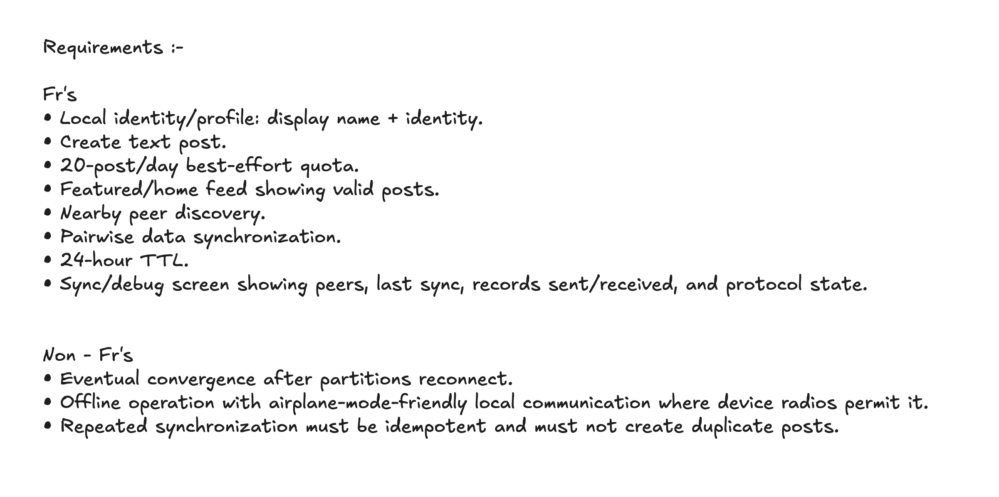
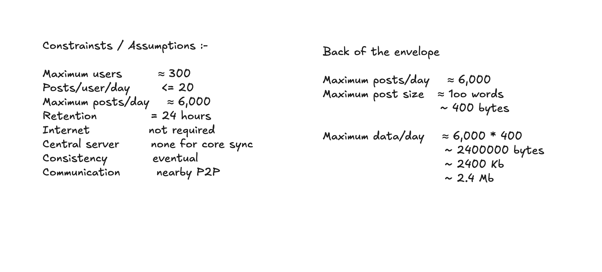
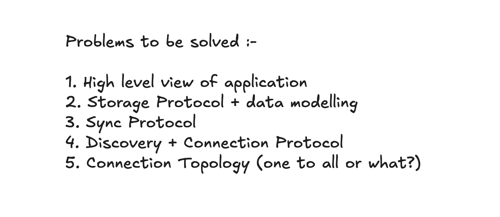
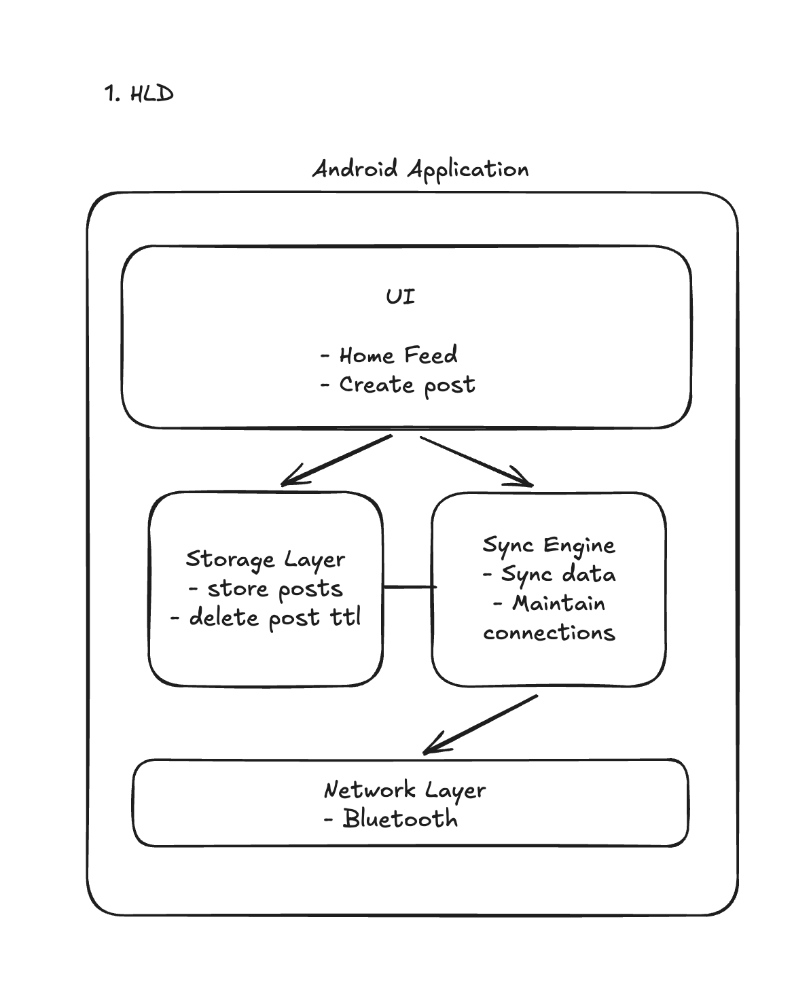
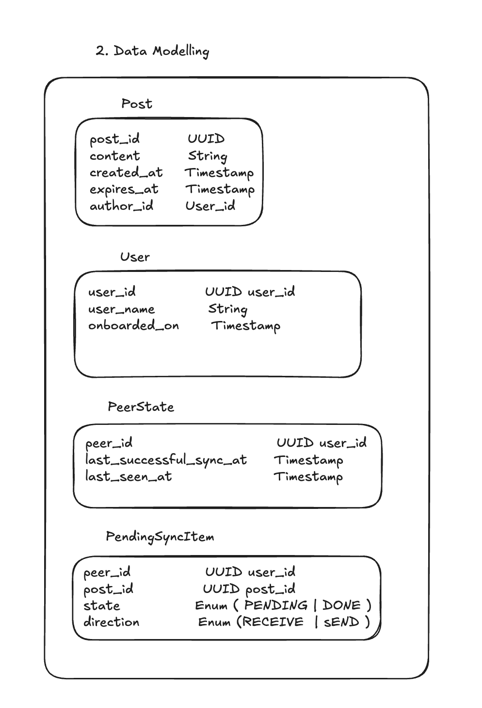
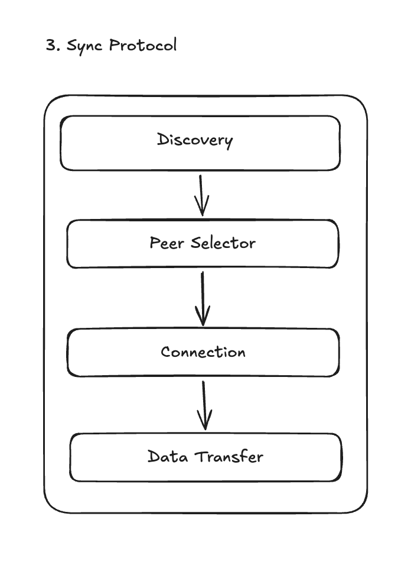
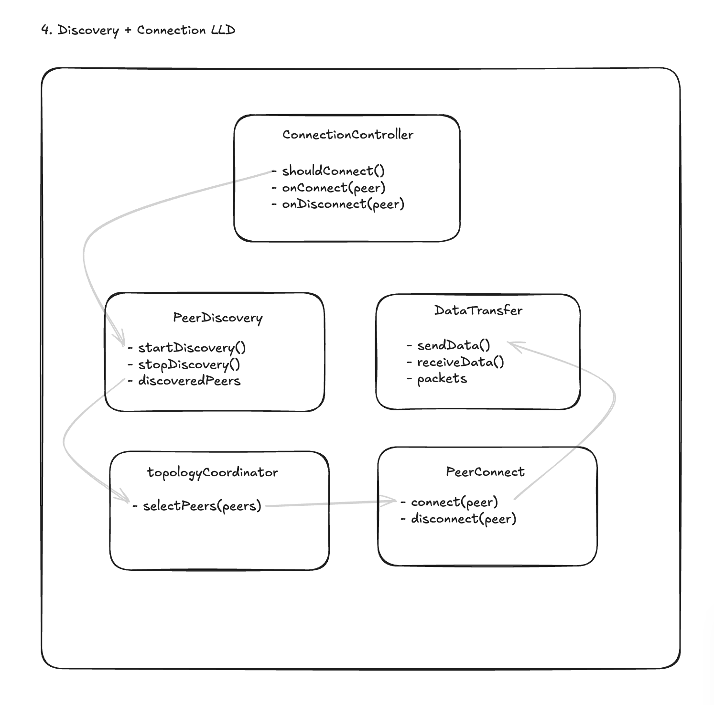
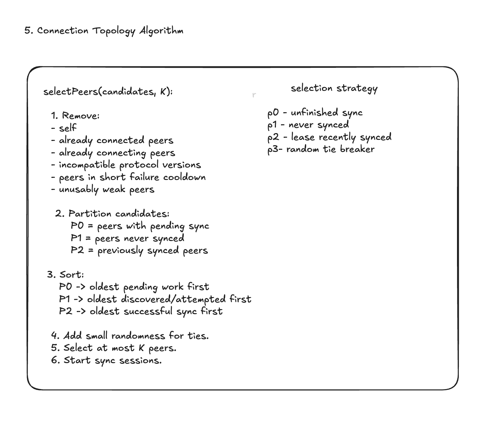

# MeshSocialStarter

An offline-first, Bluetooth P2P social feed for Android. Two nearby devices
discover each other over BLE, connect via GATT, and converge their post feeds
without any server or internet connection.

---

## Requirements



### Functional requirements

- Local identity/profile: display name + identity.
- Create text post.
- 20-post/day best-effort quota.
- Featured/home feed showing valid posts.
- Nearby peer discovery.
- Pairwise data synchronization.
- 24-hour TTL.
- Sync/debug screen showing peers, last sync, records sent/received, and protocol state.

### Non-functional requirements

- Eventual convergence after partitions reconnect.
- Offline operation with airplane-mode-friendly local communication where device radios permit it.
- Repeated synchronization must be idempotent and must not create duplicate posts.

---

## Constraints / Assumptions



| Constraint | Value | | Back-of-the-envelope | Value |
|---|---|---|---|---|
| Maximum users | ≈ 300 | | Maximum posts/day | ≈ 6,000 |
| Posts/user/day | ≤ 20 | | Maximum post size | ≈ 100 words (~400 bytes) |
| Maximum posts/day | ≈ 6,000 | | Maximum data/day | ≈ 6,000 × 400 ≈ 2.4 MB |
| Retention | 24 hours | | | |
| Internet | not required | | | |
| Central server | none for core sync | | | |
| Consistency | eventual | | | |
| Communication | nearby P2P | | | |

---

## Problems to be solved



1. High-level view of the application.
2. Storage protocol + data modelling.
3. Sync protocol.
4. Discovery + connection protocol.
5. Connection topology (one-to-all or what?).

---

## 1. High-level design (HLD)



```text
┌──────────────────────────────────────────┐
│           Android Application            │
│  ┌────────────────────────────────────┐  │
│  │ UI                                 │  │
│  │  - Home Feed                       │  │
│  │  - Create post                     │  │
│  └────────────────────────────────────┘  │
│  ┌──────────────┐    ┌─────────────────┐ │
│  │ Storage Layer│<-->│ Sync Engine     │ │
│  │ - store posts│    │ - sync data     │ │
│  │ - delete ttl │    │ - maintain conns│ │
│  └──────────────┘    └────────┬────────┘ │
│                               │          │
│  ┌────────────────────────────▼────────┐ │
│  │ Network Layer                       │ │
│  │ - Bluetooth                         │ │
│  └─────────────────────────────────────┘ │
└──────────────────────────────────────────┘
```

---

## 2. Data modelling



```text
Post
  post_id      UUID
  content      String
  created_at   Timestamp
  expires_at   Timestamp
  author_id    User_id

User
  user_id      UUID
  user_name    String
  onboarded_on Timestamp

PeerState
  peer_id                    UUID
  last_successful_sync_at    Timestamp
  last_seen_at               Timestamp

PendingSyncItem
  peer_id     UUID
  post_id     UUID
  state       Enum (PENDING | DONE)
  direction   Enum (RECEIVE | SEND)
```

---

## 3. Sync protocol



```text
Hello(protocolVersion, peerId)
Inventory(sessionId, postIds)
RequestPosts(sessionId, postIds)
PostBatch(sessionId, batchId, posts)
Ack(sessionId, batchId)
SyncComplete(sessionId)
```

Reconnection invariant: resume persisted pending work first, then exchange a
**fresh inventory** and diff against the current Post table. Insert durably,
remove the pending record, and only mark successful reconciliation when pending
work is empty. We do **not** persist a `posts_synced[B]` list as the source of
truth — it would go stale as devices independently meet others.

---

## 4. Discovery + connection (LLD)



```text
ConnectionController          PeerDiscovery            DataTransfer
- shouldConnect()             - startDiscovery()       - sendData()
- onConnect(peer)             - stopDiscovery()        - receiveData()
- onDisconnect(peer)          - discoveredPeers        - packets

topologyCoordinator           PeerConnect
- selectPeers(peers)          - connect(peer)
                              - disconnect(peer)
```

---

## 5. Connection topology algorithm



```text
selectPeers(candidates, K):
1. Remove:
   - self
   - already-connected peers
   - already-connecting peers
   - incompatible protocol versions
   - peers in short failure cooldown
   - unusably weak peers
2. Partition candidates:
   P0 = peers with pending sync
   P1 = peers never synced
   P2 = previously synced peers
3. Sort:
   P0 -> oldest pending work first
   P1 -> oldest discovered/attempted first
   P2 -> oldest successful sync first
4. Add small randomness for ties.
5. Select at most K peers.
6. Start sync sessions.
```

Selection strategy: `p0` unfinished sync, `p1` never synced, `p2` least recently
synced, `p3` random tie-break.

---

## What is implemented

- Native Android / Kotlin / Jetpack Compose shell.
- Local UUID profile (`User`) and posts (`Post`) with UUID `post_id`, Room persistence.
- Best-effort 20-post rolling 24-hour quota; 24-hour TTL with periodic cleanup.
- Persisted `PeerState` and normalized `PendingSyncItem`.
- In-memory pairwise anti-entropy synchronizer (`PairwiseAntiEntropySynchronizer`) with resumable interrupted convergence.
- Nearby peer discovery over BLE scan/advertise (`BlePeerDiscovery`) with the stable peer UUID carried in manufacturer data.
- Connection topology (`DefaultTopologyPolicy`) + `ConnectionCoordinator` (P0/P1/P2, cooldown, collision rule).
- BLE GATT client + server (`BlePeerConnection`, `BleGattServer`, `BleGattServerConnection`), MTU negotiation, HELLO handshake.
- Binary `MessageCodec` for all `SyncMessage` types.
- `SyncSession` driving Inventory / RequestPosts / PostBatch / Ack / SyncComplete over the GATT link.
- Unit tests for topology, codec, tracker, and the in-memory synchronizer.

Verified end-to-end on two emulators: discovery → top-K selection → single
initiator → GATT connect → HELLO → full post convergence (both devices hold the
same posts).

---

## Code map (HLD/LLD box → code)

```text
HLD / LLD box                  Code
------------------------------------------------------------------
Storage Layer                  data/local + data/repository
User/Post                      domain/model/Models.kt
PeerState                      domain/model + Room entity/DAO
PendingSyncItem                domain/model + Room entity/DAO
Sync Engine                    sync/PairwiseAntiEntropySynchronizer
Sync protocol                  protocol/SyncMessage.kt
Message codec                  protocol/MessageCodec.kt
SyncSession                    sync/SyncSession.kt
Peer Discovery                 discovery/PeerDiscovery.kt
BLE discovery                  ble/BlePeerDiscovery.kt
Topology Coordinator/Policy    topology/TopologyPolicy.kt
Connection Coordinator         connection/ConnectionCoordinator.kt
Peer Connector                 connection/PeerConnector.kt → ble/BleGattConnector.kt
Peer Connection                connection/PeerConnection.kt → ble/BlePeerConnection.kt + ble/BleGattServerConnection.kt
BLE GATT server                ble/BleGattServer.kt
```

---

## First run

1. Run the app on one phone/emulator.
2. Create a profile.
3. Create posts and restart the app: posts should survive.
4. Open **Debug**.
5. Press **Run interrupted/resumed sync demo**.

Run unit tests:

```bash
./gradlew testDebugUnitTest
```

---

## Two-emulator demo (BLE sync)

The Android emulator supports BLE via netsim (API 31+). Two emulators on the
same host share one virtual radio:

```bash
# launch two AVDs (second launched after the first so they share netsimd)
emulator @Pixel_7_API_36   &
emulator @Pixel_7_API_36_B -netsim-args --rssi=ble:-65 &

# install on both
./gradlew installDebug

# grant BLE permissions
adb shell pm grant com.example.meshsocial android.permission.BLUETOOTH_SCAN
adb shell pm grant com.example.meshsocial android.permission.BLUETOOTH_ADVERTISE
adb shell pm grant com.example.meshsocial android.permission.BLUETOOTH_CONNECT
```

Then on each: **Nearby → Scan for nearby devices**, wait for the scan window to
close, and posts converge.

---

## Known V1 simplifications

- One app installation is treated as one user/peer for now.
- User profile replication is not implemented; remote posts render with short author UUIDs.
- Feed ordering uses local wall-clock `createdAt`; clock-skew handling/HLC is later work.
- Strict global 20-post quota is not possible in a disconnected multi-device identity model; V1 enforces locally.
- No cryptographic authorship verification in V1.
- Message framing/chunking (`FrameCodec`) for large payloads is not yet implemented (each message is a single write).

## Next steps

1. Background/foreground-service behavior so sync runs without the app in the foreground.
2. `FrameCodec` for messages larger than the negotiated ATT MTU.
3. Automatic topology rotation (disconnect after reconciliation, rotate through peers).
4. Sync/debug screen surfacing live peers, last sync, records sent/received, and protocol state.
